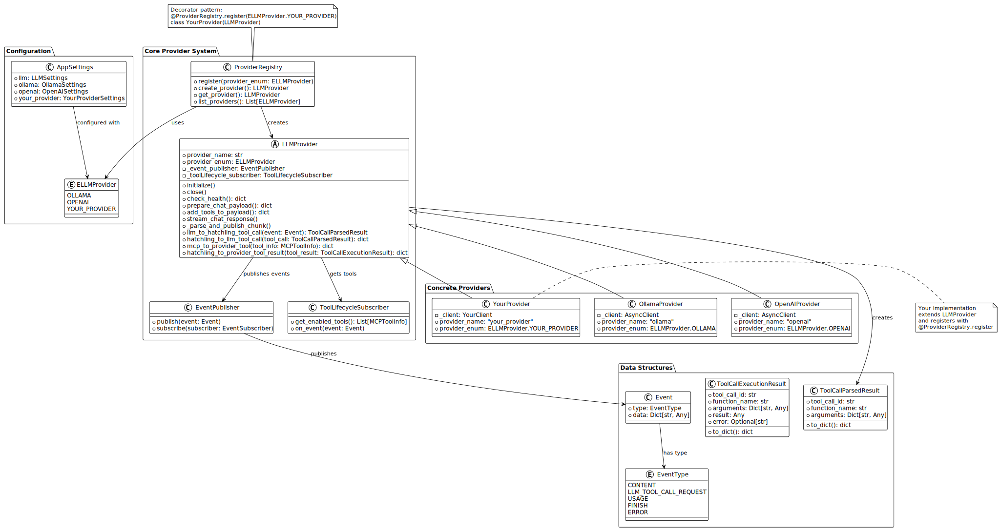
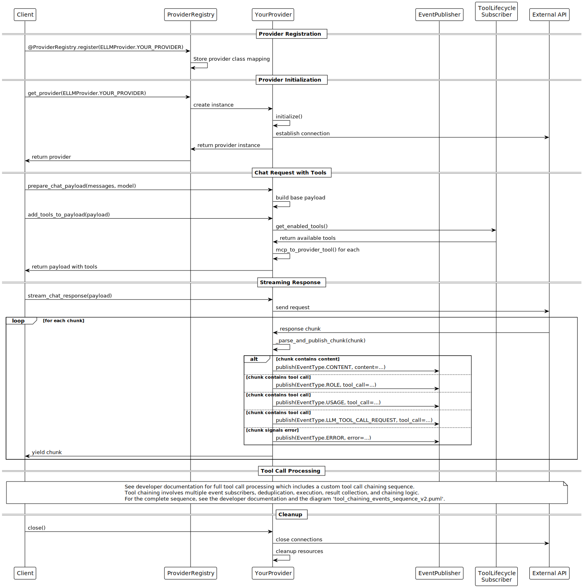

# Implementing New LLM Providers

This article is about:

- Extending the provider system with new LLM service integrations (e.g. Anthropic, Mistral, Ollama, OpenAI, and so on  )
- Leveraging the event-driven communication and tool integration
- Writing the tests for the provider implementations

## Overview

Hatchling's LLM provider system provides an interface to connect with LLM providers.
The system relies on an abstract base classes, decorator-based registration, and event-driven communication. 



The interaction flow demonstrates how providers integrate with the broader system:



## Architecture Components

### Core File Structure

The provider system is organized around three key files:

```
hatchling/core/llm/providers/
├── base.py                       # Abstract interface definition (no need to touch)
├── registry.py                   # Registration and discovery system (no need to touch)
├── <provider_name>_provider.py   # Provider implementation (This is what you will implement)
```

### Interface Requirements

FThe name of the provider `provider_name` and `provider_enum` are declared in ([`llm_settings.py`](../../../../hatchling/config/llm_settings.py)), While the `LLMProvider` abstract base class in [`base.py`](../../../../hatchling/core/llm/providers/base.py) defines twelve methods organized into functional groups:

**Identity and Lifecycle**:

- `initialize()` and `close()`: Resource management and connection lifecycle ())
- `check_health()`: Service availability validation

**Request Processing**:

- `prepare_chat_payload()`: Convert standard requests to provider-specific format
- `add_tools_to_payload()`: Integrate available tools into request payload
- `stream_chat_response()`: Handle asynchronous response streaming

**Event Integration**:

- `_parse_and_publish_chunk()`: Parse responses and emit standardized events

**Data Conversion**:

- `llm_to_hatchling_tool_call()`: Normalize provider tool calls to Hatchling format
- `hatchling_to_llm_tool_call()`: Convert Hatchling tool calls to provider format
- `mcp_to_provider_tool()`: Transform MCP tools to provider-specific schemas
- `hatchling_to_provider_tool_result()`: Convert tool execution results to provider format

## Implementation Process

### Step 1: Provider Registration

Add your provider to the `ELLMProvider` enum in [`llm_settings.py`](../../../../hatchling/config/llm_settings.py):

```python
class ELLMProvider(Enum):
    OLLAMA = "ollama"
    OPENAI = "openai"
    YOUR_PROVIDER = "your_provider"
```

### Step 2: Configuration Design

You might want to take a look at the developer resource about [settings](../settings_architecture.md) if you want to get a better picture of this architecture. When adding your provider, you can enrich the settings by doing the following:

- Add your provider-specific settings using Pydantic models in a new file at `/Hatchling/hatchling/config/<provider_name>_settings.py` and name it `<ProviderName>Settings`. Refer to existing implementations such as [`ollama_settings.py`](../../../../hatchling/config/ollama_settings.py).

- Add this new settings category to the `AppSettings` class for discoverability in [`/Hatchling/hatchling/config/settings.py`] following the template `<provider_name>: <ProviderName>Settings = Field(default_factory=<ProviderName>Settings)` (e.g. `ollama: OllamaSettings = Field(default_factory=OllamaSettings)`)

- Finally, for translated documentation, add the `name`, `description`, and `hint` for every setting you added in the new settings class `<ProviderName>Settings` into the translation files under `Hatchling/hatchling/config/languages`. For example in `e,.toml`, the following few settings are already defined for Ollama

```toml
# ... other fields before

# Ollama settings (new/expanded)
[settings.ollama.ip]
name = "Ollama IP Address"
description = "IP address for the Ollama API endpoint."
hint = "Example: localhost"

[settings.ollama.port]
name = "Ollama Port"
description = "Port for the Ollama API endpoint."
hint = "Example: 11434"

# and so on...
```

### Step 3: Provider Implementation

For all the following steps, we highly encourage to check the existing implementations in [`ollama_provider.py`](../../../../hatchling/core/llm/providers/ollama_provider.py) and [`openai_provider.py`](../../../../hatchling/core/llm/providers/openai_provider.py).

Implement your provider class using the registration decorator using the enum value you entered [previously](#step-1-provider-registration):

```python
from hatchling.core.llm.providers.base import LLMProvider

@ProviderRegistry.register(ELLMProvider.YOUR_PROVIDER)
class <ProviderName>Provider(LLMProvider):
    def __init__(self, settings: AppSettings = None):
        # initialization code...
```

The presence of the `AppSettings` as an optional argument of the instantiation is mandatory.

**Connection Management**: Initialize your API client in `initialize()` and ensure proper cleanup in `close()`. The exact content of both will vary depending on the LLM provider, but will likely include for initialization the communication client, the event subscribers and publisher.

```python
from <provider_package> import AsyncClient # if there is one
from hatchling.core.llm.event_system.event_publisher import EventPublisher
from hatchling.mcp_utils.manager import mcp_manager
from hatchling.mcp_utils.mcp_tool_lifecycle_subscriber import ToolLifecycleSubscriber

# code of the <ProviderName>Provider class here

def initialize(self) -> None:
    self._client = AsyncClient(host=self._settings.ollama.api_base)
    self._toolLifecycle_subscriber = ToolLifecycleSubscriber(ELLMProvider.OLLAMA.value, self.mcp_to_provider_tool)
    self._event_publisher = EventPublisher()
    mcp_manager.publisher.subscribe(self._toolLifecycle_subscriber)
```

And for closing, at least clear the subcriptions:

```python
def close(self) -> None:
    mcp_manager.publisher.unsubscribe(self._toolLifecycle_subscriber)
    self._event_publisher.clear_subscribers()
```

**Request Processing**: Convert standard message formats to your provider's schema:

```python
def prepare_chat_payload(self, messages, model, **kwargs):
    # The content truly depends on your LLM's api.
    # The important part is that you return the dict containing
    # all the settings and messages to pass to the target LLM provider.
    # That may require processing that you are free to implement here. 
    payload = {
        "model": model,
        "messages": messages,
        "stream": kwargs.get("stream", True),
        # and more
    }

    return payload
```

**Tool Integration**: Retrieve enabled tools and them to the payload that will be sent to the LLM.

```python
def add_tools_to_payload(self, payload, tools=None):
    enabled_tools = self._toolLifecycle_subscriber.get_enabled_tools()
    if enabled_tools:
        provider_tools = [self.mcp_to_provider_tool(tool) for tool in enabled_tools]
        payload["tools"] = provider_tools
    return payload
```

### Step 4: Event System Integration

Your provider participates in Hatchling's event system by publishing events during response processing. Example from `OpenAIProvider`:

```python
def _parse_and_publish_chunk(self, chunk):
    # Publish content event
    if chunk.choices:
        delta = chunk.choices[0].delta
        if hasattr(delta, 'content') and delta.content:
            self._event_publisher.publish(Event(
                type=EventType.CONTENT,
                data={"content": delta.content, "role": "assistant"}
            ))
    # Publish tool call event
    if delta.tool_calls:
        self._event_publisher.publish(Event(
            type=EventType.LLM_TOOL_CALL_REQUEST,
            data={"tool_calls": delta.tool_calls}
        ))
```

You must therefore use the appropriate [event types](../../../../hatchling/core/llm/event_system/event_data.py) which, for an LLM response stream, include:

```python
class EventType(Enum):

    # more entries...
    
    # LLM Response Events
    CONTENT = "content"              # Text content from the model
    ROLE = "role"                   # Role assignment (assistant, user, etc.)
    FINISH = "finish"               # Stream completion with reason
    USAGE = "usage"                 # Token usage statistics
    ERROR = "error"                 # Error occurred during streaming

    # Tool Execution Events (LLM-side)
    LLM_TOOL_CALL_REQUEST = "llm_tool_call_request"    # LLM requests a tool/function call

    # more entries...
```

### Step 6: Data structures conversions

When building the payload for requests that support tool calling (as in [step 3](#step-3-provider-implementation)), you must translate the MCP tool definitions retrieved by Hatchling into the provider's schema for tool/function registration. The `mcp_to_provider_tool` method reads the relevant fields (name, description, parameters, etc.) and produces the correct provider format, ensuring the provider receives the necessary tool metadata. It can be as simple as:

```python
def mcp_to_provider_tool(self, tool_info: MCPToolInfo) -> Dict[str, Any]:
    return {
        "name": tool_info.name,
        "description": tool_info.description,
        "parameters": tool_info.parameters
    }
```

But the actual content of the dictionary returned depends on your LLM provider's format.

Then, when your LLM provider emits a tool call request (often as part of a streamed response), you must translate the provider-specific format into Hatchling's standard format. This is the purpose of `llm_to_hatchling_tool_call`: it extracts the relevant fields from the provider's event that was published with `LLM_TOOL_CALL_REQUEST` in the [step 4](#step-4-event-system-integration) and produces a `ToolCallParsedResult` that the rest of Hatchling can process in a unified way. This normalization step is crucial for interoperability and enables the system to handle tool calls from any provider using the same logic.

```python
def llm_to_hatchling_tool_call(self, event: Event) -> Optional[ToolCallParsedResult]:
    tool_call = event.data.get("tool_call", {})
    return ToolCallParsedResult(
        tool_call_id=tool_call.get("id", ""),
        function_name=tool_call.get("function", {}).get("name", ""),
        arguments=json.loads(tool_call.get("function", {}).get("arguments", "{}"))
    )
```

Of the above, the most critical part is probably going to be how your provider handles the arguments. If it returns a string (as does OpenAI's API), using the `json.loads` to convert is mandatory, but it might be coming already as a dict (as does Ollama's API), or something else.

Moreover, chats with LLMs requires the chat history (including, what the user said, what the LLM answered, the tool calls and the tool results) to be in a specific format that varies from one provider to another. That is why, we must also implement `hatchling_to_llm_tool_call` method to convert back the `ToolCallParsedResult` (produced by `llm_to_hatchling_tool_call`) to inform the LLM about tool calls in its native schema. 

```python
def hatchling_to_llm_tool_call(self, tool_call: ToolCallParsedResult) -> Dict[str, Any]:
    return {
        "id": tool_call.tool_call_id,
        "function": {
            "name": tool_call.function_name,
            "arguments": json.dumps(tool_call.arguments)
        }
    }
```

And this also stands true for results after executing the function corresponding to the original tool call. We must be able to convert Hatchling's standardized tool call execution result into a format the LLM provider expects. The `hatchling_to_provider_tool_result` method handles this translation: it takes the standardized `ToolCallExecutionResult` and produces a provider-specific dictionary. 

```python
def hatchling_to_provider_tool_result(self, tool_result: ToolCallExecutionResult) -> Dict[str, Any]:
    return {
        "tool_call_id": tool_result.tool_call_id,
        "role": "tool",
        "content": str(tool_result.result)
    }
```

The dictionary will notably be inserted in the message history as:

```python
{
    "role" : "tool"
    "content" : <result of hatchling_to_provider_tool_result>
}
```

### Step 6: Testing Implementation

For this step, we highly encourage to use existing [`integration_test_ollama.py`](../../../../tests/integration_test_ollama.py) and [`integration_test_openai.py`](../../../../tests/integration_test_openai.py)

Design comprehensive tests using Hatchling's conditional decorators:

```python
@integration_test
@requires_api_key
@requires_external_service("ollama")
def test_provider_registration(self):
    self.assertIn(ELLMProvider.OLLAMA, ProviderRegistry.list_providers())
```

Focus testing on core functionality:

- Provider registration and discovery
- Health check validation with real endpoints
- Payload preparation and request formatting
- Streaming response handling and event emission
- Tool integration and conversion accuracy
- Error handling and recovery scenarios
