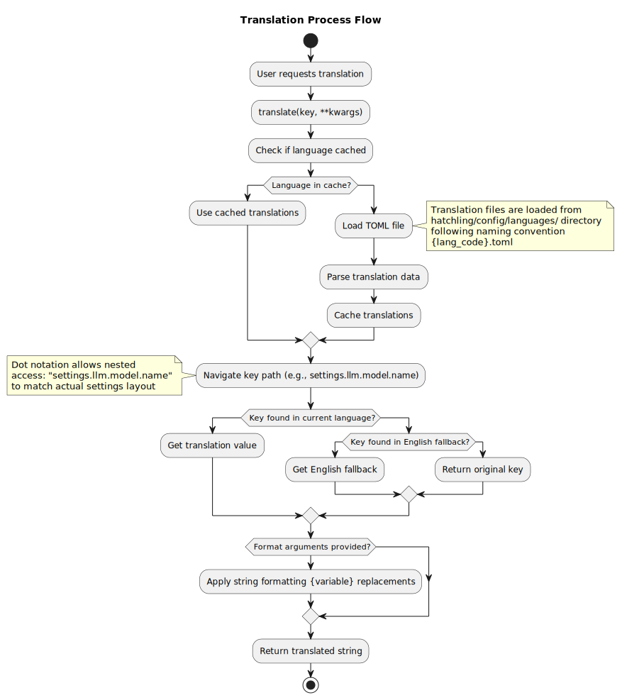

# Internationalization (i18n) Support

This article is about:

- Translation system architecture and design
- TOML-based translation file format
- Runtime language switching mechanism

You will learn about:

- How translation loading and caching works
- Translation file structure and validation
- Integration with settings and command systems

## Overview

The i18n system provides runtime language switching with automatic fallback to English for missing translations. Translation files use TOML format with nested key structures accessed via dot notation.

## Architecture Components

### TranslationLoader

The `TranslationLoader` class manages all translation operations:

- **File Loading**: Parses TOML translation files from the languages directory
- **Caching**: In-memory cache with thread-safe access for performance
- **Fallback**: Automatic fallback to English for missing keys
- **Runtime Switching**: Dynamic language changes without restart

### Translation File Format

Translation files follow a structured TOML format with specific sections:

#### Meta Section

Contains language metadata:

```toml
[meta]
language_code = "en"
language_name = "English"
version = "1.0.0"
```

#### Settings Section

Hierarchical structure for settings translations:

```toml
[settings.categories]
llm = "LLM Configuration"

[settings.llm]
category_name = "LLM Configuration"
category_description = "Settings for language model configuration"

[settings.llm.api_url]
name = "API URL"
description = "URL for the Ollama API endpoint"
hint = "Example: http://localhost:11434/api"
```

#### Commands Section

Command names and descriptions:

```toml
[commands.base]
help_name = "help"
help_description = "Display help for available commands"
```

### Global Access Pattern

The system uses a global singleton pattern with convenience functions:

- `get_translation_loader()`: Access global instance
- `translate(key, **kwargs)`: Translate with format arguments
- `set_language(code)`: Change current language

## Design Patterns

### Singleton Pattern

Global translation loader ensures consistent state across the application.

## Translation Process Flow

Translation lookup follows a consistent pattern: current language → fallback to English → return key if not found.



## Integration Points

### Settings System

Translation keys are used throughout the settings system for:

- Category display names
- Setting names and descriptions
- Help text and hints

### Command System

Commands use translated strings for:

- Command names (in localized versions)
- Help descriptions
- Error and success messages

### Chat Interface

The chat system displays translated text for:

- Command feedback
- Error messages
- Status information

## Current Language Support

- **English (en)**: Default/template language with complete coverage
- **French (fr)**: Full translation available

Translation files are located in `hatchling/config/languages/` with naming convention `{language_code}.toml`.

## Key Files

- `hatchling/config/i18n.py`: Translation loader implementation
- `hatchling/config/languages/`: Translation files directory
- `hatchling/config/languages/en.toml`: English template
- `hatchling/config/languages/fr.toml`: French translation
