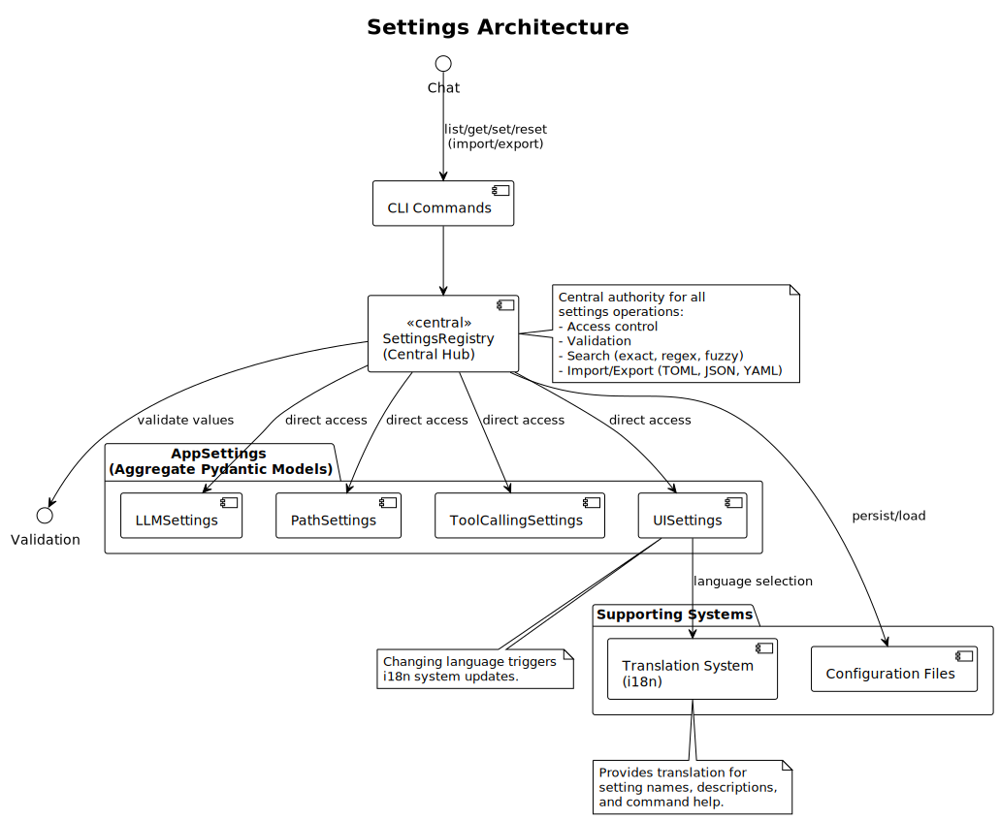

# Settings Architecture

This article is about:

- Modular settings configuration system design
- Settings registry and access control patterns
- Architecture of the settings abstraction layer

## Overview

The settings are organized into categories (LLM, paths, tool calling, UI) with centralized management through `SettingsRegistry`.

> [!Warning]
> Although called a "registry", the current implementation do not follow all the archetypes expected in a registry pattern. In particular, there is no dynamic registration of settings categories at this point (this is static in )

## Architecture Components

### Settings Categories

Settings are organized into separate modules:

- **LLMSettings**: API configuration for language model interactions
- **PathSettings**: File and directory path management
- **ToolCallingSettings**: Behavior control for tool execution
- **UISettings**: User interface preferences including language selection

Each category follows the same pattern with Pydantic models for validation and default values.

### Settings Registry

The `SettingsRegistry` class provides centralized management:

- **Access Control**: Enforces normal, protected, and read-only access levels
- **Validation**: Uses Pydantic for type checking and constraint validation
- **Search**: Implements staged search (exact, category, regex, fuzzy matching)
- **Import/Export**: Supports TOML, JSON, and YAML formats

### Access Levels

Three access levels control setting modification:

- `NORMAL`: Standard settings that can be changed freely
- `PROTECTED`: Sensitive settings requiring explicit force flag
- `READ_ONLY`: System-computed values that cannot be modified

## Integration Points

### Translation System

Settings integrate with the i18n system for display names and descriptions. See `docs/articles/devs/i18n_support.md` for details.

### Command Interface

Settings commands are exposed through the chat interface via `SettingsCommands` class. See `hatchling/core/chat/settings_commands.py` for implementation.

### Configuration Persistence

Settings are automatically persisted to configuration files and can be imported/exported in multiple formats.

## Architecture Diagram

## Key Files

- `hatchling/config/settings.py`: Root settings aggregation
- `hatchling/config/settings_registry.py`: Central registry implementation
- `hatchling/config/*_settings.py`: Individual category implementations
- `hatchling/core/chat/settings_commands.py`: Command interface
